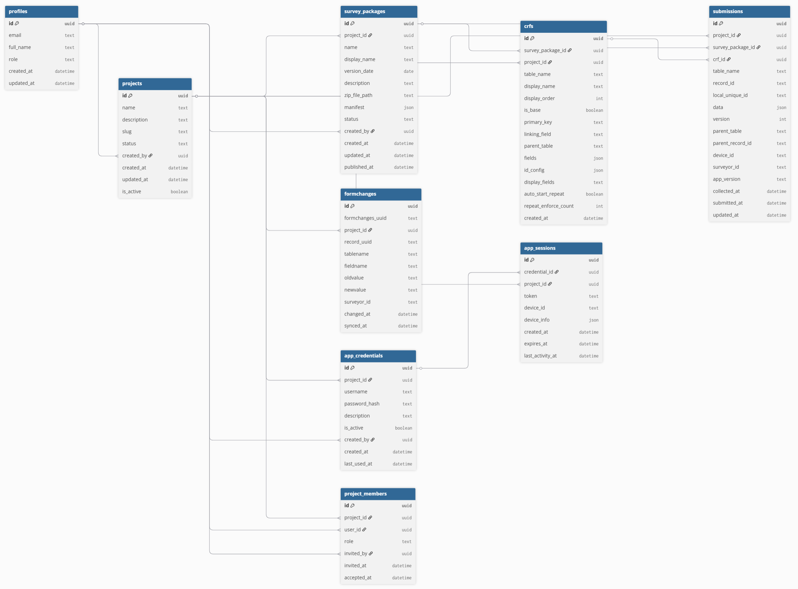

# System Architecture & Database Schema

## Table Descriptions

### 1. Hierarchy & Access

* **profiles**: Website Users. It stores usernames and name/email extensions.

| id       | email               | full_name    | role | created_at                    | updated_at                    |
| -------- | ------------------- | ------------ | ---- | ----------------------------- | ----------------------------- |
| 51094065 | email@yahoo.com     | Test account | user | 2025-12-31 10:31:21.345614+00 | 2026-01-05 13:05:20.277826+00 |
| fd93198d | glavoy@email.com    | Geoff        | user | 2026-01-03 02:24:59.79217+00  | 2026-01-05 13:05:20.277826+00 |


* **projects**: The main folder. Everything belongs to a project.

| id      | name                      | description | slug       | status | created_by| created_at                   | updated_at                   | is_active |
| ------- | ------------------------- | ----------- | ---------- | ------ | --------- | ---------------------------- | ---------------------------- | --------- |
| fc6d35d5| R21 Test Negative - Geoff |             | r21testneg | active | fd93198d  | 2026-01-18 14:49:46.47106+00 | 2026-01-18 14:49:46.47106+00 | true      |

* **project_members**: The Access List. It links a Profile to a Project. If you aren't in this table for Project X, you can't see Project X.

| id       | project_id | user_id  | role  | invited_by | invited_at                   | accepted_at                  |
| ------------------------------------ | ------------------------------------ | ------------------------------------ | ----- | ---------- | ---------------------------- | ---------------------------- |
| 91ff2174 | fc6d35d5   | fd93198d | owner | null       | 2026-01-18 14:49:46.47106+00 | 2026-01-18 14:49:46.47106+00 |

### 2. The Survey Definitions
* **survey_packages**: The Zip File/Bundle. When you upload a survey design, it creates a row here. It represents "Version 1 of the Malaria Survey".

| id       | project_id | name                            | display_name                    | version_date | description | zip_file_path            | manifest                            | status | created_by   | created_at                    | updated_at                 | published_at |
| -------- | ---------- | ------------------------------- | ------------------------------- | ------------ | ----------- | ------------------------ | ----------------------------------- | ------ | ------------ | ----------------------------- | -------------------------- | ------------ |
| 1722a44b | fc6d35d5   | r21_test_negative_data_kollecta | R21 Test Negative Data Kollecta | 2026-01-19   | null        | fc6d35_data_kollecta.zip | {"crfs":[{"isbase":1,"tablename"...}]} | active | fd93198d     | 2026-01-19 11:20:16.297526+00 | 2026-01-19 13:14:03.316+00 | null         |

* **crfs**: The Forms. Each form/crf/questionnaire in the survey package has a row in this table describing the structure of each form.

| id       | survey_package_id | project_id | table_name | display_name   | display_order | is_base | primary_key | linking_field | parent_table | fields                                                  | id_config                                         | display_fields             | auto_start_repeat | repeat_enforce_count | created_at                    |
| -------- | ----------------- | ---------- | ---------- | -------------- | ------------- | ------- | ----------- | ------------- | ------------ | ------------------------------------------------------- | ------------------------------------------------- | -------------------------- | ----------------- | -------------------- | ----------------------------- |
| 018899c5 | 1722a44b          | fc6d35d5   | followup   | Follow Up Form | 1             | false   | null        | null          | null         | []                                                      | null                                              | null                       | false             | 1                    | 2026-01-19 11:27:58.09858+00  |
| cc4f7b37 | 1722a44b          | fc6d35d5   | enrollee   | Enrollee       | 10            | true    | subjid      | subjid        | null         | [{"id":"ef17cc5a","text":"Please enter the 3-digit...}] | {{"prefix": "","fields": [{"name": "device...}]}} | startdate,participantsname | false             | 1                    | 2026-01-19 11:20:16.706397+00 |


### 3. The Field App (Data Collectors)
* **app_credentials**: Field Worker Accounts. These are the simple login codes (e.g., surveyor1) that data collectors type into the Android app. They are distinct from website users.

| id       | project_id | username | password_hash | description             | is_active | created_by  | created_at                   | last_used_at |
| -------- | ---------- | -------- | ------------- | ----------------------- | --------- | ----------- | ---------------------------- | ------------ |
| 7981a46e | fc6d35d5   | r21      | xyz           | R21 Test Negative study | true      | fd93198d    | 2026-01-20 03:47:23.26618+00 | null         |


* **app_sessions**: Active Devices. When a phone logs in, it creates a session here.

| id       | credential_id | project_id | token    | device_id  | device_info         | created_at                    | expires_at                | last_activity_at              |
| -------- | ------------- | ---------- | -------- | ---------- | ------------------- | ----------------------------- | ------------------------- | ----------------------------- |
| 4434313a | 7981a46e      | fc6d35d5   | 1647c747 | {9C798D94} | Windows: Windows 11 | 2026-01-20 03:50:30.648518+00 | 2026-02-19 03:50:30.61+00 | 2026-01-20 03:50:30.648518+00 |

### 4. The Data
* **submissions**: The data uploaded from the mobile app. Every time a form is completed and synced, it is stored here. The actual data is stored in JSON format.

| id       | project_id | survey_package_id | crf_id | table_name | record_id | local_unique_id | data                                          | version | parent_table | parent_record_id | device_id       | surveyor_id | app_version        | collected_at                  | submitted_at                  | updated_at                 |
| -------- | ---------- | ----------------- | ------ | ---------- | --------- | --------------- | --------------------------------------------- | ------- | ------------ | ---------------- | --------------- | ----------- | ------------------ | ----------------------------- | ----------------------------- | -------------------------- |
| b32939a0 | fc6d35d5   | e4bd2ef3          | null   | enrollee   | null      | de6523f4        | {"age":"0","dob":"2025-09-20","mrc":"096"...} | 1       | null         | null             | {9C798D94BB5A0} | geoff       | DataKollecta 0.1.0 | 2026-01-20 06:57:17.230018+00 | 2026-01-20 03:57:23.031597+00 | 2026-01-20 03:57:22.987+00 |


* **formchanges**: The Audit Trail. If you edit a submission on the website, the old version is saved here so you never lose data.

| id       | formchanges_uuid | project_id | record_uuid | tablename | fieldname | oldvalue                   | newvalue                   | surveyor_id | changed_at                    | synced_at                  |
| -------- | ---------------- | ---------- | ----------- | --------- | --------- | -------------------------- | -------------------------- | ----------- | ----------------------------- | -------------------------- |
| e0aa9175 | 3f3dffa9         | fc6d35d5   | de6523f4    | enrollee  | lastmod   | 2026-01-20T06:57:17.230018 | 2026-01-20T07:06:47.717484 | 99          | 2026-01-20 07:06:47.755596+00 | 2026-01-20 04:06:58.491+00 |
| 49b6d0dc | c50add7d         | fc6d35d5   | de6523f4    | enrollee  | synced_at | 2026-01-20T06:57:23.237906 | null                       | 99          | 2026-01-20 07:06:47.774342+00 | 2026-01-20 04:06:58.566+00 |
| a5ce3ef8 | 0aa2fe94         | fc6d35d5   | de6523f4    | enrollee  | comments  | null                       | SDS                        | 99          | 2026-01-20 07:06:47.783091+00 | 2026-01-20 04:06:58.608+00 |

---

#### Database schema


### General flow
- create new login - user added to the `profiles` table
- create a new project
    - after creating a new project, there are records in two tables: `projects`, `project_members`
- in the new project - upload a 'survey' zip file
    - this creates records in the tables: `survey_packages`, `crfs`
- create a 'team member' - under add credentials ion teh team member tab - this creats a record in the table: `app_credentials`
- team member enters credentials on the phone and checks for surveys - writes record to the `app_sessions` table
- user uploads data - data saved to the `submissions` table and if there are changes, they are saved to the `formchnages` table


## Technical Schema

### 1. Database Column Schema

**Query:**
```sql
SELECT table_name, ordinal_position, column_name, data_type
FROM information_schema.columns
WHERE table_schema = 'public'
ORDER BY table_name, ordinal_position;
```

| table_name      | ordinal_position | column_name          | data_type                |
| --------------- | ---------------- | -------------------- | ------------------------ |
| app_credentials | 1                | id                   | uuid                     |
| app_credentials | 2                | project_id           | uuid                     |
| app_credentials | 3                | username             | text                     |
| app_credentials | 4                | password_hash        | text                     |
| app_credentials | 5                | description          | text                     |
| app_credentials | 6                | is_active            | boolean                  |
| app_credentials | 7                | created_by           | uuid                     |
| app_credentials | 8                | created_at           | timestamp with time zone |
| app_credentials | 9                | last_used_at         | timestamp with time zone |
| app_sessions    | 1                | id                   | uuid                     |
| app_sessions    | 2                | credential_id        | uuid                     |
| app_sessions    | 3                | project_id           | uuid                     |
| app_sessions    | 4                | token                | text                     |
| app_sessions    | 5                | device_id            | text                     |
| app_sessions    | 6                | device_info          | jsonb                    |
| app_sessions    | 7                | created_at           | timestamp with time zone |
| app_sessions    | 8                | expires_at           | timestamp with time zone |
| app_sessions    | 9                | last_activity_at     | timestamp with time zone |
| crfs            | 1                | id                   | uuid                     |
| crfs            | 2                | survey_package_id    | uuid                     |
| crfs            | 3                | project_id           | uuid                     |
| crfs            | 4                | table_name           | text                     |
| crfs            | 5                | display_name         | text                     |
| crfs            | 6                | display_order        | integer                  |
| crfs            | 7                | is_base              | boolean                  |
| crfs            | 8                | primary_key          | text                     |
| crfs            | 9                | linking_field        | text                     |
| crfs            | 10               | parent_table         | text                     |
| crfs            | 11               | fields               | jsonb                    |
| crfs            | 12               | id_config            | jsonb                    |
| crfs            | 13               | display_fields       | text                     |
| crfs            | 14               | auto_start_repeat    | boolean                  |
| crfs            | 15               | repeat_enforce_count | integer                  |
| crfs            | 16               | created_at           | timestamp with time zone |
| formchanges     | 1                | id                   | uuid                     |
| formchanges     | 2                | formchanges_uuid     | text                     |
| formchanges     | 3                | project_id           | uuid                     |
| formchanges     | 4                | record_uuid          | text                     |
| formchanges     | 5                | tablename            | text                     |
| formchanges     | 6                | fieldname            | text                     |
| formchanges     | 7                | oldvalue             | text                     |
| formchanges     | 8                | newvalue             | text                     |
| formchanges     | 9                | surveyor_id          | text                     |
| formchanges     | 10               | changed_at           | timestamp with time zone |
| formchanges     | 11               | synced_at            | timestamp with time zone |
| profiles        | 1                | id                   | uuid                     |
| profiles        | 2                | email                | text                     |
| profiles        | 3                | full_name            | text                     |
| profiles        | 5                | role                 | text                     |
| profiles        | 6                | created_at           | timestamp with time zone |
| profiles        | 7                | updated_at           | timestamp with time zone |
| project_members | 1                | id                   | uuid                     |
| project_members | 2                | project_id           | uuid                     |
| project_members | 3                | user_id              | uuid                     |
| project_members | 4                | role                 | USER-DEFINED             |
| project_members | 5                | invited_by           | uuid                     |
| project_members | 6                | invited_at           | timestamp with time zone |
| project_members | 7                | accepted_at          | timestamp with time zone |
| projects        | 1                | id                   | uuid                     |
| projects        | 2                | name                 | text                     |
| projects        | 3                | description          | text                     |
| projects        | 4                | slug                 | text                     |
| projects        | 5                | status               | text                     |
| projects        | 6                | created_by           | uuid                     |
| projects        | 7                | created_at           | timestamp with time zone |
| projects        | 8                | updated_at           | timestamp with time zone |
| projects        | 9                | is_active            | boolean                  |
| submissions     | 1                | id                   | uuid                     |
| submissions     | 2                | project_id           | uuid                     |
| submissions     | 3                | survey_package_id    | uuid                     |
| submissions     | 4                | crf_id               | uuid                     |
| submissions     | 5                | table_name           | text                     |
| submissions     | 6                | record_id            | text                     |
| submissions     | 7                | local_unique_id      | text                     |
| submissions     | 8                | data                 | jsonb                    |
| submissions     | 9                | version              | integer                  |
| submissions     | 10               | parent_table         | text                     |
| submissions     | 11               | parent_record_id     | text                     |
| submissions     | 12               | device_id            | text                     |
| submissions     | 13               | surveyor_id          | text                     |
| submissions     | 14               | app_version          | text                     |
| submissions     | 15               | collected_at         | timestamp with time zone |
| submissions     | 16               | submitted_at         | timestamp with time zone |
| submissions     | 17               | updated_at           | timestamp with time zone |
| survey_packages | 1                | id                   | uuid                     |
| survey_packages | 2                | project_id           | uuid                     |
| survey_packages | 3                | name                 | text                     |
| survey_packages | 4                | display_name         | text                     |
| survey_packages | 5                | version_date         | date                     |
| survey_packages | 6                | description          | text                     |
| survey_packages | 7                | zip_file_path        | text                     |
| survey_packages | 8                | manifest             | jsonb                    |
| survey_packages | 9                | status               | USER-DEFINED             |
| survey_packages | 10               | created_by           | uuid                     |
| survey_packages | 11               | created_at           | timestamp with time zone |
| survey_packages | 12               | updated_at           | timestamp with time zone |
| survey_packages | 13               | published_at         | timestamp with time zone |

---

### 2. Foreign Key Constraints

**Query:**
```sql
  kcu.table_schema || '.' || kcu.table_name AS foreign_table,
  kcu.column_name AS fk_column,
  '->' AS rel,
  ccu.table_schema || '.' || ccu.table_name AS primary_table,
  ccu.column_name AS pk_column
FROM information_schema.key_column_usage kcu
JOIN information_schema.constraint_column_usage ccu
  ON kcu.constraint_name = ccu.constraint_name
  AND kcu.constraint_schema = ccu.constraint_schema
WHERE kcu.constraint_schema = 'public'
  AND kcu.ordinal_position IS NOT NULL
ORDER BY foreign_table, kcu.ordinal_position;
```

| foreign_table          | fk_column         | rel | primary_table          | pk_column         |
| ---------------------- | ----------------- | --- | ---------------------- | ----------------- |
| public.app_credentials | project_id        | ->  | public.app_credentials | project_id        |
| public.app_credentials | created_by        | ->  | public.profiles        | id                |
| public.app_credentials | project_id        | ->  | public.projects        | id                |
| public.app_credentials | project_id        | ->  | public.app_credentials | username          |
| public.app_credentials | id                | ->  | public.app_credentials | id                |
| public.app_credentials | username          | ->  | public.app_credentials | username          |
| public.app_credentials | username          | ->  | public.app_credentials | project_id        |
| public.app_sessions    | project_id        | ->  | public.projects        | id                |
| public.app_sessions    | credential_id     | ->  | public.app_credentials | id                |
| public.app_sessions    | token             | ->  | public.app_sessions    | token             |
| public.app_sessions    | id                | ->  | public.app_sessions    | id                |
| public.crfs            | survey_package_id | ->  | public.crfs            | survey_package_id |
| public.crfs            | project_id        | ->  | public.projects        | id                |
| public.crfs            | survey_package_id | ->  | public.survey_packages | id                |
| public.crfs            | survey_package_id | ->  | public.crfs            | table_name        |
| public.crfs            | id                | ->  | public.crfs            | id                |
| public.crfs            | table_name        | ->  | public.crfs            | table_name        |
| public.crfs            | table_name        | ->  | public.crfs            | survey_package_id |
| public.formchanges     | project_id        | ->  | public.projects        | id                |
| public.formchanges     | id                | ->  | public.formchanges     | id                |
| public.formchanges     | formchanges_uuid  | ->  | public.formchanges     | formchanges_uuid  |
| public.formchanges     | project_id        | ->  | public.projects        | id                |
| public.profiles        | id                | ->  | public.profiles        | id                |
| public.project_members | id                | ->  | public.project_members | id                |
| public.project_members | project_id        | ->  | public.project_members | project_id        |
| public.project_members | project_id        | ->  | public.project_members | user_id           |
| public.project_members | invited_by        | ->  | public.profiles        | id                |
| public.project_members | project_id        | ->  | public.projects        | id                |
| public.project_members | user_id           | ->  | public.profiles        | id                |
| public.project_members | user_id           | ->  | public.project_members | project_id        |
| public.project_members | user_id           | ->  | public.project_members | user_id           |
| public.projects        | created_by        | ->  | public.projects        | created_by        |
| public.projects        | created_by        | ->  | public.profiles        | id                |
| public.projects        | id                | ->  | public.projects        | id                |
| public.projects        | created_by        | ->  | public.projects        | slug              |
| public.projects        | slug              | ->  | public.projects        | slug              |
| public.projects        | slug              | ->  | public.projects        | created_by        |
| public.submissions     | project_id        | ->  | public.projects        | id                |
| public.submissions     | id                | ->  | public.submissions     | id                |
| public.submissions     | crf_id            | ->  | public.crfs            | id                |
| public.submissions     | survey_package_id | ->  | public.survey_packages | id                |
| public.survey_packages | created_by        | ->  | public.profiles        | id                |
| public.survey_packages | project_id        | ->  | public.survey_packages | project_id        |
| public.survey_packages | project_id        | ->  | public.survey_packages | name              |
| public.survey_packages | id                | ->  | public.survey_packages | id                |
| public.survey_packages | project_id        | ->  | public.projects        | id                |
| public.survey_packages | name              | ->  | public.survey_packages | project_id        |
| public.survey_packages | name              | ->  | public.survey_packages | name              |
---

### 3. Row Level Security (RLS) Policies

**Query:**
```sql
SELECT tablename, policyname, roles, cmd, qual, with_check FROM pg_policies WHERE schemaname = 'public';
```

| tablename | policyname | roles | cmd | qual | with_check |
| :--- | :--- | :--- | :--- | :--- | :--- |
| app_credentials | Owners can view credentials | {authenticated} | SELECT | (EXISTS (SELECT 1 FROM project_members pm WHERE ((pm.project_id = pm.project_id) AND (pm.user_id = auth.uid()) AND (pm.role = 'owner'::project_role)))) | null |
| profiles | Users can view own profile | {public} | SELECT | (auth.uid() = id) | null |
| profiles | Users can update own profile | {public} | UPDATE | (auth.uid() = id) | null |
| projects | Owners can update projects | {authenticated} | UPDATE | (EXISTS (SELECT 1 FROM project_members pm WHERE ((pm.project_id = pm.id) AND (pm.user_id = auth.uid()) AND (pm.role = 'owner'::project_role)))) | null |
| projects | Owners can delete projects | {authenticated} | DELETE | (EXISTS (SELECT 1 FROM project_members pm WHERE ((pm.project_id = pm.id) AND (pm.user_id = auth.uid()) AND (pm.role = 'owner'::project_role)))) | null |
| project_members | Users can view own memberships | {authenticated} | SELECT | (user_id = auth.uid()) | null |
| project_members | Allow member creation | {authenticated} | INSERT | null | (((user_id = auth.uid()) AND (role = 'owner'::project_role)) OR (EXISTS (SELECT 1 FROM project_members pm WHERE ((pm.project_id = project_members.project_id) AND (pm.user_id = auth.uid()) AND (pm.role = 'owner'::project_role))))) |
| project_members | Owners can update memberships | {authenticated} | UPDATE | (EXISTS (SELECT 1 FROM project_members pm WHERE ((pm.project_id = project_members.project_id) AND (pm.user_id = auth.uid()) AND (pm.role = 'owner'::project_role)))) | null |
| project_members | Owners can delete memberships | {authenticated} | DELETE | (EXISTS (SELECT 1 FROM project_members pm WHERE ((pm.project_id = project_members.project_id) AND (pm.user_id = auth.uid()) AND (pm.role = 'owner'::project_role)))) | null |
| survey_packages | Users can view project surveys | {authenticated} | SELECT | (EXISTS (SELECT 1 FROM project_members pm WHERE ((pm.project_id = pm.project_id) AND (pm.user_id = auth.uid())))) | null |
| survey_packages | Editors can manage surveys | {authenticated} | ALL | (EXISTS (SELECT 1 FROM project_members pm WHERE ((pm.project_id = pm.project_id) AND (pm.user_id = auth.uid()) AND (pm.role = ANY (ARRAY['editor'::project_role, 'owner'::project_role]))))) | null |
| crfs | Users can view project crfs | {authenticated} | SELECT | (EXISTS (SELECT 1 FROM project_members pm WHERE ((pm.project_id = pm.project_id) AND (pm.user_id = auth.uid())))) | null |
| crfs | Editors can manage crfs | {authenticated} | ALL | (EXISTS (SELECT 1 FROM project_members pm WHERE ((pm.project_id = pm.project_id) AND (pm.user_id = auth.uid()) AND (pm.role = ANY (ARRAY['editor'::project_role, 'owner'::project_role]))))) | null |
| submissions | Users can view project submissions | {authenticated} | SELECT | (EXISTS (SELECT 1 FROM project_members pm WHERE ((pm.project_id = pm.project_id) AND (pm.user_id = auth.uid())))) | null |
| submissions | Editors can manage submissions | {authenticated} | ALL | (EXISTS (SELECT 1 FROM project_members pm WHERE ((pm.project_id = pm.project_id) AND (pm.user_id = auth.uid()) AND (pm.role = ANY (ARRAY['editor'::project_role, 'owner'::project_role]))))) | null |
| submission_history | Users can view submission history | {authenticated} | SELECT | (EXISTS (SELECT 1 FROM (submissions s JOIN project_members pm ON ((pm.project_id = s.project_id))) WHERE ((s.id = submission_history.submission_id) AND (pm.user_id = auth.uid())))) | null |
| app_credentials | Owners can manage credentials | {authenticated} | ALL | (EXISTS (SELECT 1 FROM project_members pm WHERE ((pm.project_id = pm.project_id) AND (pm.user_id = auth.uid()) AND (pm.role = 'owner'::project_role)))) | null |
| app_sessions | Owners can view sessions | {authenticated} | SELECT | (EXISTS (SELECT 1 FROM project_members pm WHERE ((pm.project_id = pm.project_id) AND (pm.user_id = auth.uid()) AND (pm.role = 'owner'::project_role)))) | null |
| projects | Enable insert for authenticated users only | {public} | INSERT | null | ((SELECT auth.role() AS role) = 'authenticated'::text) |
| projects | Users can view member projects | {public} | SELECT | ((auth.uid() = created_by) OR (EXISTS (SELECT 1 FROM project_members pm WHERE ((pm.project_id = projects.id) AND (pm.user_id = auth.uid()))))) | null |


```
CREATE TABLE public.app_credentials (
  id uuid NOT NULL DEFAULT uuid_generate_v4(),
  project_id uuid NOT NULL,
  username text NOT NULL,
  password_hash text NOT NULL,
  description text,
  is_active boolean DEFAULT true,
  created_by uuid,
  created_at timestamp with time zone DEFAULT now(),
  last_used_at timestamp with time zone,
  CONSTRAINT app_credentials_pkey PRIMARY KEY (id),
  CONSTRAINT app_credentials_project_id_fkey FOREIGN KEY (project_id) REFERENCES public.projects(id),
  CONSTRAINT app_credentials_created_by_fkey FOREIGN KEY (created_by) REFERENCES public.profiles(id)
);
CREATE TABLE public.app_sessions (
  id uuid NOT NULL DEFAULT uuid_generate_v4(),
  credential_id uuid,
  project_id uuid,
  token text NOT NULL UNIQUE,
  device_id text,
  device_info jsonb,
  created_at timestamp with time zone DEFAULT now(),
  expires_at timestamp with time zone NOT NULL,
  last_activity_at timestamp with time zone DEFAULT now(),
  CONSTRAINT app_sessions_pkey PRIMARY KEY (id),
  CONSTRAINT app_sessions_credential_id_fkey FOREIGN KEY (credential_id) REFERENCES public.app_credentials(id),
  CONSTRAINT app_sessions_project_id_fkey FOREIGN KEY (project_id) REFERENCES public.projects(id)
);
CREATE TABLE public.crfs (
  id uuid NOT NULL DEFAULT uuid_generate_v4(),
  survey_package_id uuid NOT NULL,
  project_id uuid NOT NULL,
  table_name text NOT NULL,
  display_name text NOT NULL,
  display_order integer DEFAULT 0,
  is_base boolean DEFAULT false,
  primary_key text,
  linking_field text,
  parent_table text,
  fields jsonb,
  id_config jsonb,
  display_fields text,
  auto_start_repeat boolean DEFAULT false,
  repeat_enforce_count integer,
  created_at timestamp with time zone DEFAULT now(),
  CONSTRAINT crfs_pkey PRIMARY KEY (id),
  CONSTRAINT crfs_survey_package_id_fkey FOREIGN KEY (survey_package_id) REFERENCES public.survey_packages(id),
  CONSTRAINT crfs_project_id_fkey FOREIGN KEY (project_id) REFERENCES public.projects(id)
);
CREATE TABLE public.formchanges (
  id uuid NOT NULL DEFAULT gen_random_uuid(),
  formchanges_uuid text NOT NULL UNIQUE,
  project_id uuid NOT NULL,
  record_uuid text NOT NULL,
  tablename text NOT NULL,
  fieldname text NOT NULL,
  oldvalue text,
  newvalue text,
  surveyor_id text,
  changed_at timestamp with time zone,
  synced_at timestamp with time zone DEFAULT now(),
  CONSTRAINT formchanges_pkey PRIMARY KEY (id),
  CONSTRAINT formchanges_project_id_fkey FOREIGN KEY (project_id) REFERENCES public.projects(id),
  CONSTRAINT fk_project FOREIGN KEY (project_id) REFERENCES public.projects(id)
);
CREATE TABLE public.profiles (
  id uuid NOT NULL,
  email text NOT NULL,
  full_name text,
  role text DEFAULT 'user'::text,
  created_at timestamp with time zone DEFAULT now(),
  updated_at timestamp with time zone DEFAULT now(),
  CONSTRAINT profiles_pkey PRIMARY KEY (id),
  CONSTRAINT profiles_id_fkey FOREIGN KEY (id) REFERENCES auth.users(id)
);
CREATE TABLE public.project_members (
  id uuid NOT NULL DEFAULT uuid_generate_v4(),
  project_id uuid,
  user_id uuid,
  role USER-DEFINED NOT NULL DEFAULT 'viewer'::project_role,
  invited_by uuid,
  invited_at timestamp with time zone DEFAULT now(),
  accepted_at timestamp with time zone,
  CONSTRAINT project_members_pkey PRIMARY KEY (id),
  CONSTRAINT project_members_project_id_fkey FOREIGN KEY (project_id) REFERENCES public.projects(id),
  CONSTRAINT project_members_user_id_fkey FOREIGN KEY (user_id) REFERENCES public.profiles(id),
  CONSTRAINT project_members_invited_by_fkey FOREIGN KEY (invited_by) REFERENCES public.profiles(id)
);
CREATE TABLE public.projects (
  id uuid NOT NULL DEFAULT uuid_generate_v4(),
  name text NOT NULL,
  description text,
  slug text NOT NULL,
  status text DEFAULT 'active'::text,
  created_by uuid DEFAULT auth.uid(),
  created_at timestamp with time zone DEFAULT now(),
  updated_at timestamp with time zone DEFAULT now(),
  is_active boolean DEFAULT true,
  CONSTRAINT projects_pkey PRIMARY KEY (id),
  CONSTRAINT projects_created_by_fkey FOREIGN KEY (created_by) REFERENCES public.profiles(id)
);
CREATE TABLE public.submissions (
  id uuid NOT NULL DEFAULT uuid_generate_v4(),
  project_id uuid NOT NULL,
  survey_package_id uuid NOT NULL,
  crf_id uuid,
  table_name text NOT NULL,
  record_id text,
  local_unique_id text NOT NULL,
  data jsonb NOT NULL,
  version integer DEFAULT 1,
  parent_table text,
  parent_record_id text,
  device_id text,
  surveyor_id text,
  app_version text,
  collected_at timestamp with time zone,
  submitted_at timestamp with time zone DEFAULT now(),
  updated_at timestamp with time zone DEFAULT now(),
  CONSTRAINT submissions_pkey PRIMARY KEY (id),
  CONSTRAINT submissions_project_id_fkey FOREIGN KEY (project_id) REFERENCES public.projects(id),
  CONSTRAINT submissions_survey_package_id_fkey FOREIGN KEY (survey_package_id) REFERENCES public.survey_packages(id),
  CONSTRAINT submissions_crf_id_fkey FOREIGN KEY (crf_id) REFERENCES public.crfs(id)
);
CREATE TABLE public.survey_packages (
  id uuid NOT NULL DEFAULT uuid_generate_v4(),
  project_id uuid,
  name text NOT NULL,
  display_name text NOT NULL,
  version_date date NOT NULL,
  description text,
  zip_file_path text,
  manifest jsonb,
  status USER-DEFINED DEFAULT 'draft'::survey_status,
  created_by uuid,
  created_at timestamp with time zone DEFAULT now(),
  updated_at timestamp with time zone DEFAULT now(),
  published_at timestamp with time zone,
  CONSTRAINT survey_packages_pkey PRIMARY KEY (id),
  CONSTRAINT survey_packages_project_id_fkey FOREIGN KEY (project_id) REFERENCES public.projects(id),
  CONSTRAINT survey_packages_created_by_fkey FOREIGN KEY (created_by) REFERENCES public.profiles(id)
);

```